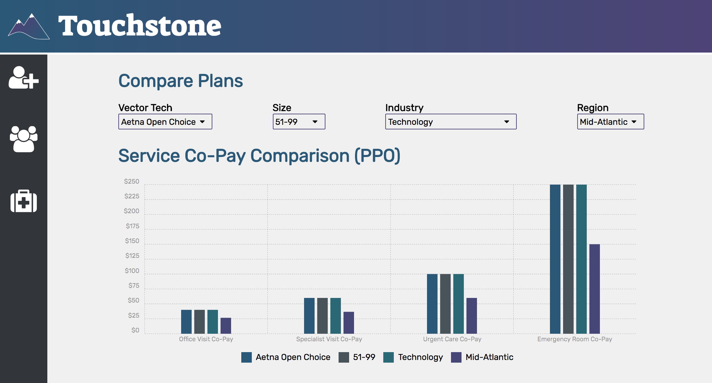

# About
Touchstone is an interactive platform where you can compare and benchmark health insurance plans across employers several different ways. Touchstone stores employer and health insurance data which can then be compared against each other by plan types, employer size, industry or just plan to plan. The flexible interface allows you to choose how you want to compare your data.
This application is geared towards insurance brokers or consultants who have several employer clients.  Thsi platform will allow them to add their client information and easily compare their plans.  

## User Stories
As a user, I should be able to:
- add employers
- add health plans to each employer
- browse for an employer and filter by name and other categories
- view all health plans under an employer
- compare health plans by sub categories of employers
- be able to compare health plans in different ways

## Future Features
- add population total graphs/comparisons (i.e. total % of plan types etc.)
- add plan cost data intake and comparisons
- automate region based on the state where employer is located
